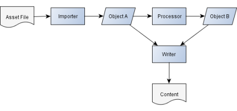

Last summer, a friend and I started to write a little [Paradroid](http://en.wikipedia.org/wiki/Paradroid) clone. Since my only real experience as a game programmer was with XNA and MonoGame, I had grown fond of the [XNA Content Pipeline](http://msdn.microsoft.com/en-us/library/ff827626.aspx), and naturally wanted something similar for this project.

The game was going to be cross platform (Windows and Linux) so the asset pipeline had to be cross platform as well. The natural step was therefore to see if the [MonoGame Content Builder](https://github.com/mono/MonoGame/wiki/MonoGame-Content-Processing) (MGCB for short) could be used for this. 

<!--excerpt-->

Alas, MonoGame is a port of XNA, and since they need to maintain backwards compatibility; they also kept the [XNB output format](http://blogs.msdn.com/b/shawnhar/archive/2011/07/07/xnb-file-format-documentation.aspx). Since we had no wish to implement reading of the XNB format to be able to use MGCB, in combination with the difficulties involved with debugging the MGCB pipeline and the lack of unit tests, we decided to build something simple of our own.

## How does it work?

The Lunt pipeline works almost exactly like the XNA Content pipeline. It's composed of two mandatory components (the importer and the writer) and one or many optional processors. 

The importers role is to read asset data from a stream and to create a managed representation of it. If a processor is defined for an asset, the managed representation will be sent there to be either transformed (a change of type) or processed in some way. The last step in the pipeline is the actual writing of the asset back to a stream, and this is the writer's responsibility.

The stream I mention is normally a file stream, but can be any kind of stream thanks to the built-in extensibility points.

A more technical explaination of the pipeline can be found in the [Lunt Wiki](https://github.com/lunt/lunt/wiki/Getting-started).

## Key points

* Build engine not tied to a specific hosting provider or output format.
* Supports incremental builds.
* Easy to debug the build pipeline by creating a debug project and referencing the Lunt build engine assembly.
* The ease of C++/CLI to call into native libraries, makes it really simple to use existing functionality such as [Assimp](http://assimp.sourceforge.net/) or [FreeType](http://www.freetype.org/) as part of the pipeline.

## Finally

I will probably continue to write posts about Lunt here from time to time, so if you're interested in knowing more, bookmark or add this blog to the RSS reader of your choice.

You can find the source code and more information on the GitHub page at [https://github.com/lunt/lunt](https://github.com/lunt/lunt).