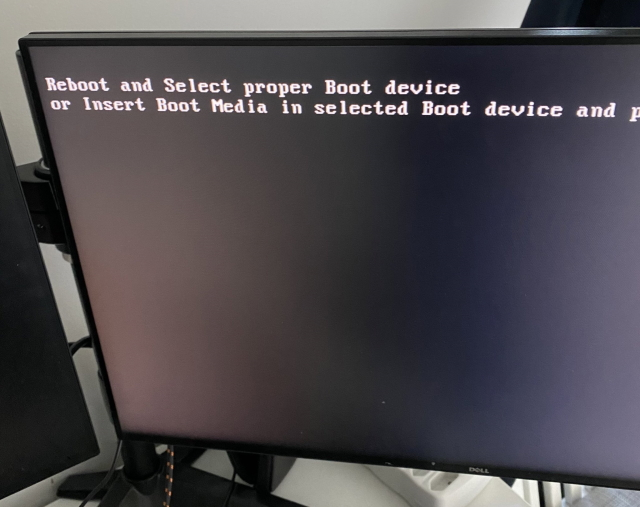
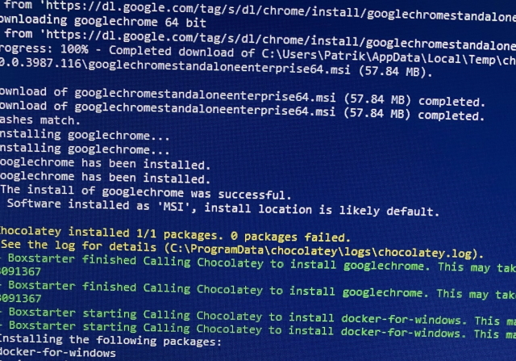
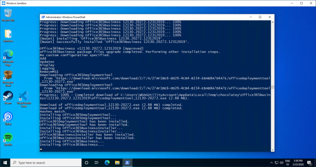

Last week I decided that I wanted to try the new version of Windows Subsystem
for Linux (conveniently
named `WSL 2`). WSL 2 requires that the computer enrolls in Windows slow ring, and
since the computer I was on didn't receive any insider builds at all, I went
ahead and enabled the slow ring. The update started, and I went to bed.

When I woke up the next morning, I saw this:



I tried restoring the master boot record using a recovery disk, but I couldn't
get this to work for some unknown reason. 

Luckily (😅), my computer crashed for almost the same reason a couple of months
ago, so I had started to prepare some scripts to help me set up a new computer
using [Chocolatey](https://chocolatey.org/) and
[Boxstarter](https://boxstarter.org/). The scripts were far from perfect but
worked well enough to get my computer up and running in less than 30 minutes.



After the installation, I started making some adjustments to the script and
wanted to try it all out. Since I want the setup part to be as smooth as
possible, I was contemplating whether to do another reinstall of Windows and
rerun it. Then I remembered that Microsoft recently released a new technology
based on [Windows Containers](https://docs.microsoft.com/en-us/virtualization/windowscontainers/about/)
called `Windows Sandbox`.

[Windows Sandbox](https://techcommunity.microsoft.com/t5/windows-kernel-internals/windows-sandbox/ba-p/301849)
is an entirely isolated environment running under your existing Windows
installation. Every time you close the sandbox, the content of it gets removed.
The sweet part of this is that it starts in mere seconds, so it's perfect for
testing things that, in some way, alter a computer's state or perform some
destructive operation.

## Installing Windows Sandbox

Installing Windows Sandbox is as simple as running the following command from a
PowerShell console:

```powershell
PS> Enable-WindowsOptionalFeature -FeatureName "Containers-DisposableClientVM" -All -Online
```

Restart your computer for the change to take effect. Once the
computer rebooted, search for `Sandbox` in the start menu to start it. The
startup time is slightly longer the first time you start it, but after the
initial run, it should start within a second or so.

## Configuring the Windows Sandbox

When I started tweaking my install scripts, the routine looked something like
this:

1. Start Windows Sandbox
2. Copy files from the host machine to the sandbox
3. Open a PowerShell prompt
4. Enable execution of PowerShell script via `Set-ExecutionPolicy`
5. Go to the script directory
6. Run the installation script
7. Wait for the script to finish running

This little routine quickly became tedious, but after some detective work on the
Internet, I discovered that this was automatable by creating a configuration file
to initialize the sandbox. The configuration file has the extension `.wsb` and 
works almost like an old fashion `.rdp` file, with the only difference that
*wsb* file is an XML file instead of an INI file. You create one and double
click it, and a new Sandbox environment gets created for you.

In my case this file looks like this:

```xml
<Configuration>
<VGpu>Disable</VGpu>
<Networking>Disable</Networking>
<MappedFolders>
   <MappedFolder>
     <HostFolder>D:\Source\github\patriksvensson\machine\windows</HostFolder>
     <ReadOnly>true</ReadOnly>
   </MappedFolder>
</MappedFolders>
<LogonCommand>
   <Command>C:\users\WDAGUtilityAccount\Desktop\machine\run.cmd</Command>
</LogonCommand>
</Configuration>
```

So by simply double-clicking on the configuration file, A new sandboxed
environment gets created, and my installation script starts.



## Detect if you're running in the sandbox

There are some things you don't want to do in a sandboxed environment. Perhaps
it's not permitted, such as installing the Windows Sandbox, or you don't
want to run some part of your script.

Detecting whether or not you're in a sandboxed environment is reasonably
straightforward; check if the current username is `WDAGUtilityAccount`.

```powershell
if($env:UserName -ne "WDAGUtilityAccount") {
    # Do things that can't be done in Windows Sandbox.
}
```

## Wrapping up

So hopefully, this blog post might be of help to you if you need a
sandboxed environment. If you're interested in taking a look at my installation
scripts, you can find them at
[https://github.com/patriksvensson/machine](https://github.com/patriksvensson/machine).
These scripts are highly personal, so you probably want to change them.
For the same reason, I'm not accepting any pull requests, but if you have any
suggestions, feel free to reach out to me on Twitter.