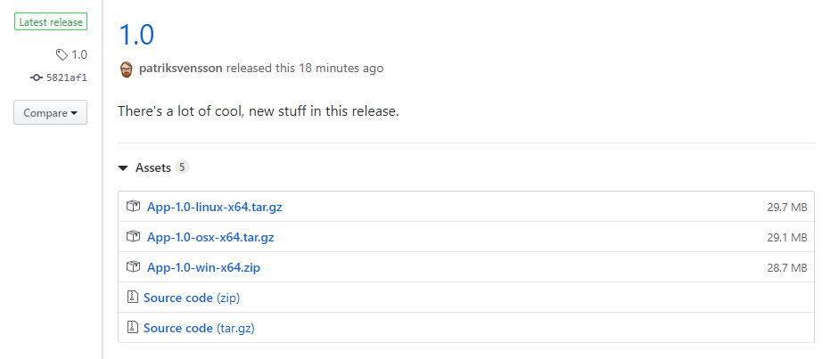
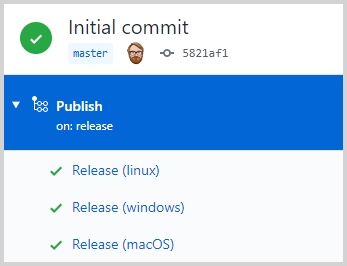

In this blog post, we'll create a [GitHub Action](https://github.com/features/actions) that triggers each time a release is published, builds a binary on three different build agents (Windows, macOS, and Ubuntu), and attaches the compressed artifacts to the release.

<!--excerpt-->

There's a myriad of ways of doing this, but this has so far worked out great for me.



For this blog post, I've created a .NET Core 3.1 console application whose only purpose is to write "Hello World" to the console. It's this application we build and package when we create a new GitHub release, and the source code can be found at [https://github.com/patriksvensson/dotnet-release-artifacts/tree/master/src](https://github.com/patriksvensson/dotnet-release-artifacts/tree/master/src)

## 1. Create the GitHub Action

We start by creating a new [workflow file](https://help.github.com/en/actions/configuring-and-managing-workflows/configuring-a-workflow#creating-a-workflow-file) under `.github/workflows` in the repository. We call this `ci.yaml`, but you can name this anything you want as long as it's a YAML file. We then proceed to tell GitHub that we want this workflow to run every time we publish a new release.

```yaml
name: Publish
on:
  release:
    types: [published]
```

## 2. Define the build strategy

Now we want to add a job, which we'll call `Release`, and define a build strategy. We'll use a [matrix](https://help.github.com/en/actions/reference/workflow-syntax-for-github-actions#jobsjob_idstrategy) with all the information we need for our different builds, such as what build agent we want to use for each element in the matrix, and what runtime to target.

```yaml
jobs:
  release:
    name: Release
    strategy:
      matrix:
        kind: ['linux', 'windows', 'macOS']
        include:
          - kind: linux
            os: ubuntu-latest
            target: linux-x64
          - kind: windows
            os: windows-latest
            target: win-x64
          - kind: macOS
            os: macos-latest
            target: osx-x64
    runs-on: ${{ matrix.os }}
```

Notice that we reference the `os` matrix metadata in the `runs-on` node via `{{ matrix.os }}`. You can reference any data defined in the matrix this way.

As you can see in the image below, the name of each step in the matrix will be a combination of the job name and the name of the matrix element.



## 3. Build, package and publish

Now when we've defined the workflow and the build matrix, we'll have to do four things.

1. Check out the code
2. Setup .NET Core and define what SDK we're going to use
3. Build our project and create the release artifacts
4. Publish the release artifacts

Let's start with the first two since there are already pre-made actions for these.

```yaml
    steps:
      - name: Checkout
        uses: actions/checkout@v1

      - name: Setup dotnet
        uses: actions/setup-dotnet@v1
        with:
          dotnet-version: 3.1.101
```

Now when everything is in place, we need to build our artifacts and publish them. Since we want to be idiomatic on all platforms, we zip the artifacts on Windows and package them as `tar.gz` on Linux and macOS.

```yaml
      - name: Build
        shell: bash
        run: |
          # Define some variables for things we need
          tag=$(git describe --tags --abbrev=0)
          release_name="App-$tag-${{ matrix.target }}"

          # Build everything
          dotnet publish src/App/App.csproj --framework netcoreapp3.1 --runtime "${{ matrix.target }}" -c Release -o "$release_name"

          # Pack files
          if [ "${{ matrix.target }}" == "win-x64" ]; then
            7z a -tzip "${release_name}.zip" "./${release_name}/*"
          else
            tar czvf "${release_name}.tar.gz" "$release_name"
          fi

          # Delete output directory
          rm -r "$release_name"
```

You might have noticed that we run the build step in a Bash shell and wonder how that works on Windows (at least I did). The answer is that it runs under Git Bash and not under Windows Subsystem for Linux (WSL), as one might have thought.

Finally, once we've built and packaged everything up, we'll add the artifacts to our release. For this, we'll use [softprops/action-gh-release](https://github.com/softprops/action-gh-release) GitHub Action, which I think works very well.

```yaml
      - name: Publish
        uses: softprops/action-gh-release@v1
        with:
          files: "App*"
        env:
          GITHUB_TOKEN: ${{ secrets.GITHUB_TOKEN }}
```

That's all there is to it. If you want to create a release, all you have to do is create a new tag, go to the GitHub release page, and create a release from the newly created tag.

```shell
> git tag 1.0
> git push --tags
```

You can find the complete YAML file [here](https://github.com/patriksvensson/dotnet-release-artifacts/blob/master/.github/workflows/ci.yaml).

## Wrapping up

As I've previously mentioned, there is a myriad of different ways of doing this. What I have described in this blog post is only one of them, but I've found that it has served me well and is reasonably easy to understand even if you're new to GitHub Actions.